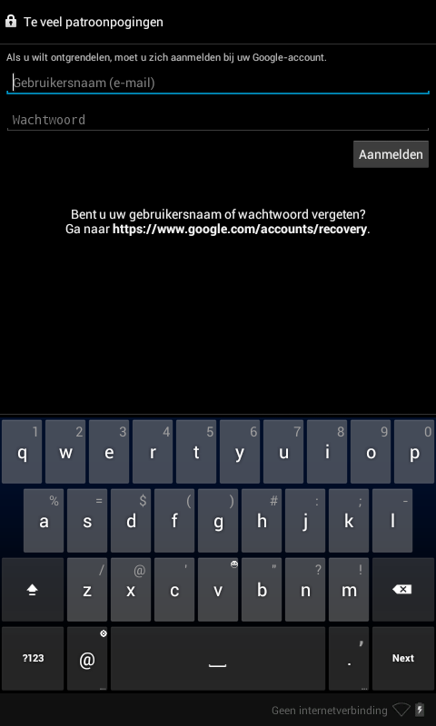

# SaloraFix

Project to fix a Salora tablet 



## Connection

The Salora must be connected directly, that is, not via a hub.

`dmesg` directly:

```
[13622.313388] usb 2-1.4: new full-speed USB device number 37 using ehci-pci
[13622.385463] usb 2-1.4: device descriptor read/64, error -32
[13622.561367] usb 2-1.4: device descriptor read/64, error -32
[13622.737276] usb 2-1.4: new full-speed USB device number 38 using ehci-pci
[13622.809265] usb 2-1.4: device descriptor read/64, error -32
[13623.592999] usb 2-1.4: new high-speed USB device number 39 using ehci-pci
[13623.686406] usb 2-1.4: New USB device found, idVendor=2207, idProduct=0000
[13623.686418] usb 2-1.4: New USB device strings: Mfr=2, Product=3, SerialNumber=4
[13623.686424] usb 2-1.4: Product: MID704
[13623.686429] usb 2-1.4: Manufacturer: rockchip
[13623.686434] usb 2-1.4: SerialNumber: LUQ24098QT
[13623.696199] usb-storage 2-1.4:1.0: USB Mass Storage device detected
[13623.696383] scsi9 : usb-storage 2-1.4:1.0
[13624.693496] scsi 9:0:0:0: Direct-Access     rockchip _usb                  PQ: 0 ANSI: 2
[13624.694124] scsi 9:0:0:1: Direct-Access     rockchip _usb                  PQ: 0 ANSI: 2
[13624.694724] sd 9:0:0:0: Attached scsi generic sg2 type 0
[13624.695059] sd 9:0:0:1: Attached scsi generic sg3 type 0
[13624.702285] sd 9:0:0:0: [sdb] Attached SCSI removable disk
[13624.704566] sd 9:0:0:1: [sdc] Attached SCSI removable disk
```

`dmesg` hub:

```
[14310.730062] usb 2-1.1.3: new full-speed USB device number 40 using ehci-pci
[14310.802035] usb 2-1.1.3: device descriptor read/64, error -32
[14310.977979] usb 2-1.1.3: device descriptor read/64, error -32
[14311.154048] usb 2-1.1.3: new full-speed USB device number 41 using ehci-pci
[14311.225915] usb 2-1.1.3: device descriptor read/64, error -32
[14311.401970] usb 2-1.1.3: device descriptor read/64, error -32
[14311.849699] usb 2-1.1.3: new high-speed USB device number 43 using ehci-pci
[14311.933678] usb 2-1.1.3: device descriptor read/64, error -71
[14312.121610] usb 2-1.1.3: device descriptor read/64, error -71
[14312.297554] usb 2-1.1.3: new high-speed USB device number 44 using ehci-pci
[14312.381521] usb 2-1.1.3: device descriptor read/64, error -71
[14374.968442] usb 2-1.1.3: new full-speed USB device number 45 using ehci-pci
[14375.040434] usb 2-1.1.3: device descriptor read/64, error -32
[14375.216359] usb 2-1.1.3: device descriptor read/64, error -32
[14375.736195] usb 2-1.1.3: new high-speed USB device number 47 using ehci-pci
[14375.820296] usb 2-1.1.3: device descriptor read/64, error -71
```
